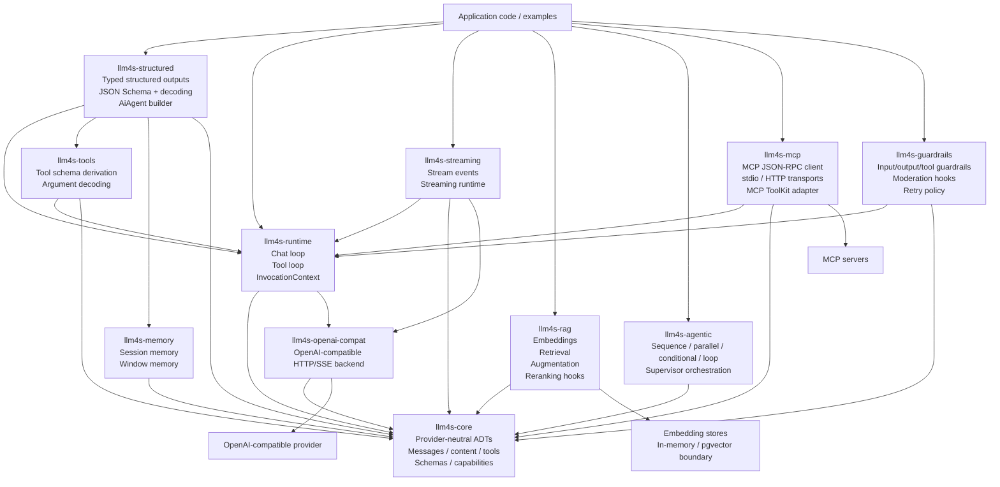

# Native Scala 3 Usage Guide

This guide explains how to use the native `llm4s-*` modules in this repository. It is usage-focused; delivery history and review context live in `CHANGELOG.md` and `CODE_REVIEW.md`.

## Architecture



## Module Map

- `llm4s-core`: provider-neutral messages, content, tools, schemas, response formats, usage, finish reasons, and model capabilities.
- `llm4s-openai-compat`: OpenAI-compatible HTTP and SSE support.
- `llm4s-runtime`: chat execution and tool-call loop.
- `llm4s-tools`: Scala 3 derivation for tool schemas and argument decoding.
- `llm4s-structured`: typed output decoding with JSON Schema response format, plus `AiAgent[F]`, a small builder over the runtime for plain chat, typed chat, and tool-using chat.
- `llm4s-streaming`: streaming events and token collection.
- `llm4s-memory`: session memory and window memory.
- `llm4s-rag`: embeddings, stores, retrieval, augmentation, advanced routing, aggregation, and reranking.
- `llm4s-agentic`: typed workflows and supervisor orchestration.
- `llm4s-mcp`: MCP JSON-RPC client, stdio/HTTP transports, and MCP-to-`ToolKit` adapter.
- `llm4s-guardrails`: input/output/tool guardrails, moderation hooks, and retry policy.

## Provider Setup

Use an OpenAI-compatible backend when calling a live model. The simplest production path is the `Resource` factory, which owns the underlying HTTP client.

```scala
import cats.effect.IO
import org.l4j.template.llm4s.openai.OpenAiCompatBackend
import org.l4j.template.llm4s.openai.OpenAiCompatConfig

val backendResource =
  OpenAiCompatBackend.resource[IO](
    OpenAiCompatConfig(
      baseUrl = "https://api.openai.com/v1",
      apiKey = sys.env("OPENAI_API_KEY"),
      model = "gpt-4.1-mini",
    )
  )
```

The same backend contract works with any OpenAI-compatible endpoint by changing `baseUrl`, `apiKey`, and `model`.

## Plain Chat

Use `AiRuntime` directly when you want explicit request/runtime control.

```scala
import cats.effect.IO
import org.l4j.template.llm4s.runtime.AiRuntime
import org.l4j.template.llm4s.runtime.ToolKit

def answer(backend: org.l4j.template.llm4s.core.ChatBackend[IO]): IO[String] =
  AiRuntime[IO](backend).chat(
    system = Some("You are concise."),
    userText = "Explain Scala 3 opaque types in one paragraph.",
    toolKit = ToolKit.empty[IO],
  )
```

Use `ChatRequest` directly when you need full control over messages, tools, response format, temperature, or metadata.

```scala
import org.l4j.template.llm4s.core.ChatMessage
import org.l4j.template.llm4s.core.ChatRequest
import org.l4j.template.llm4s.runtime.AiRuntime

val request = ChatRequest(
  messages = List(
    ChatMessage.SystemMessage.from("Answer as a senior Scala engineer."),
    ChatMessage.UserMessage.from("When should I use inline methods?"),
  ),
  temperature = Some(0.2),
)

val effect = AiRuntime[IO](backend).chatRequest(request)
```

## `AiAgent` Builder

Use `AiAgent[F]` for a small, non-macro facade over `AiRuntime` and `StructuredOutputRuntime`. It returns `F[A]` directly — no `unsafeRunSync`, no `@experimental` — and uses native Scala 3 string interpolation in place of `{{placeholder}}` templates.

```scala
import cats.effect.IO
import org.l4j.template.llm4s.structured.AiAgent

def greet(agent: AiAgent[IO], name: String): IO[String] =
  agent.chat(
    system = "You are friendly and concise.",
    user = s"Say hello to $name",
  )

val program: IO[String] =
  greet(AiAgent[IO](backend), "Ada")
```

Tool-using chat is the same call shape — attach a `ToolKit` with `withTools`:

```scala
val tooled = AiAgent[IO](backend).withTools(myToolKit)

def explain(topic: String): IO[String] =
  tooled.chat(
    system = "You are a programming tutor. Call tools first when relevant.",
    user = s"Explain: $topic",
  )
```

## Tools

Use `ToolDefinition.fromProduct` to derive tool schema and argument decoding from a Scala product type.

```scala
import cats.effect.IO
import org.l4j.template.llm4s.core.ToolResult
import org.l4j.template.llm4s.runtime.AiRuntime
import org.l4j.template.llm4s.runtime.ToolKit
import org.l4j.template.llm4s.tools.ToolDefinition
import org.l4j.template.llm4s.tools.SchemaEncoder.given
import org.l4j.template.llm4s.tools.ValueDecoder.given

final case class WeatherArgs(city: String, units: Option[String])

val weatherTool =
  ToolDefinition.fromProduct[IO, WeatherArgs](
    name = "weather",
    description = "Fetches current weather for a city.",
  ) { args =>
    IO.pure(ToolResult.Text(s"${args.city}: 72 degrees"))
  }

val toolKit: ToolKit[IO] = weatherTool.toToolKit

val result = AiRuntime[IO](backend).chat(
  system = Some("Use tools when useful."),
  userText = "What is the weather in Chicago?",
  toolKit = toolKit,
)
```

Supported derived inputs include primitives, nested case classes, enums, `Option`, and `List`.

## Structured Outputs

Use `StructuredCodec.derived` for typed case-class outputs. The runtime requests JSON Schema output when supported and decodes the final assistant response.

```scala
import cats.effect.IO
import org.l4j.template.llm4s.structured.StructuredCodec
import org.l4j.template.llm4s.structured.StructuredOutputRuntime
import org.l4j.template.llm4s.tools.SchemaEncoder.given
import org.l4j.template.llm4s.tools.ValueDecoder.given

final case class Summary(title: String, bullets: List[String])

given StructuredCodec[Summary] = StructuredCodec.derived[Summary]

val summary: IO[Summary] =
  StructuredOutputRuntime.chat[IO, Summary](
    backend = backend,
    config = org.l4j.template.llm4s.runtime.RuntimeConfig(),
    system = Some("Return only structured output."),
    userText = "Summarize the benefits of Scala 3.",
  )
```

`AiAgent.chatAs[A]` is the same flow at higher level when a `StructuredCodec[A]` is in scope:

```scala
val review: IO[Summary] =
  AiAgent[IO](backend).chatAs[Summary](
    system = "Return only structured output.",
    user = "Summarize the benefits of Scala 3.",
  )
```

## Streaming

Use `StreamingAiRuntime` with a `StreamingChatBackend`. For OpenAI-compatible
providers, `OpenAiCompatStreamingBackend.resource` builds an owned backend with
the bundled async-http-client SSE transport.

```scala
import cats.effect.IO
import org.l4j.template.llm4s.openai.OpenAiCompatConfig
import org.l4j.template.llm4s.openai.OpenAiCompatStreamingBackend
import org.l4j.template.llm4s.streaming.StreamingAiRuntime
import org.l4j.template.llm4s.streaming.StreamEvent

val program =
  OpenAiCompatStreamingBackend.resource[IO](
    OpenAiCompatConfig(
      baseUrl = "https://api.openai.com/v1",
      apiKey = sys.env("OPENAI_API_KEY"),
      model = "gpt-4.1-mini",
    )
  ).use { streamingBackend =>
    val stream = StreamingAiRuntime[IO](streamingBackend).stream(
      system = Some("Be concise."),
      userText = "Stream a short explanation of effect types.",
    )

    val printEvents = stream.events.evalMap {
      case StreamEvent.TextDelta(value) => IO.println(value)
      case other                        => IO.println(other.toString)
    }.compile.drain

    printEvents *> stream.collectText.void
  }
```

The native event model currently surfaces text deltas, thinking deltas, tool-call deltas, and final completion.

## Memory

Use `InMemoryChatMemory` for session memory, and wrap it with `MessageWindowMemory` to keep only recent messages.

```scala
import cats.effect.IO
import org.l4j.template.llm4s.memory.InMemoryChatMemory
import org.l4j.template.llm4s.memory.MemoryId
import org.l4j.template.llm4s.memory.MemoryAwareRuntime
import org.l4j.template.llm4s.memory.MessageWindowMemory
import org.l4j.template.llm4s.runtime.AiRuntime

val program =
  for
    base <- InMemoryChatMemory.create[IO, MemoryId]
    memory = MessageWindowMemory[IO, MemoryId](base, maxMessages = 20)
    runtime = MemoryAwareRuntime(AiRuntime[IO](backend), memory)
    first <- runtime.chat(MemoryId("user-123"), Some("Remember context."), "My name is Ada.")
    second <- runtime.chat(MemoryId("user-123"), Some("Remember context."), "What is my name?")
  yield second
```

`AiAgent` also has memory-aware variants: `chatWithMemory` and `chatAsWithMemory[A]` accept a `ChatMemory[F, Id]` and the session id directly.

## RAG

Use `EmbeddingModel`, `EmbeddingStore`, and `ContentRetriever` to build retrieval. `DefaultRetrievalAugmentor` rewrites the last user message with retrieved context and returns the sources.

```scala
import cats.effect.IO
import org.l4j.template.llm4s.core.ChatMessage
import org.l4j.template.llm4s.core.ChatRequest
import org.l4j.template.llm4s.rag.*

val embeddingModel = new EmbeddingModel[IO]:
  override def embed(text: String): IO[EmbeddingVector] =
    IO.pure(EmbeddingVector.of(1.0, 0.0))

val program =
  for
    store <- InMemoryEmbeddingStore.create[IO]
    _ <- store.add(
      List(
        EmbeddingRecord("scala", "Scala 3 supports inline macros.", EmbeddingVector.of(1.0, 0.0))
      )
    )
    retriever = EmbeddingContentRetriever[IO](embeddingModel, store, maxResults = 3)
    augmentor = DefaultRetrievalAugmentor[IO](retriever)
    augmented <- augmentor.augment(
      ChatRequest(List(ChatMessage.UserMessage.from("How do Scala macros work?")))
    )
    answer <- AiRuntime[IO](backend).chatRequest(augmented.request)
  yield answer -> augmented.sources
```

Use `AdvancedContentRetriever` when you need query transformation, multi-retriever routing, de-duplication, reranking, and result limiting.

```scala
import org.l4j.template.llm4s.rag.AdvancedContentRetriever
import org.l4j.template.llm4s.rag.QueryRouter
import org.l4j.template.llm4s.rag.QueryTransformer
import org.l4j.template.llm4s.rag.ReRanker

val advanced = AdvancedContentRetriever[IO](
  queryTransformer = QueryTransformer.static[IO](q => List(q, s"$q examples")),
  queryRouter = QueryRouter.static[IO](List(retriever)),
  reRanker = ReRanker.byScore[IO],
  maxResults = 4,
)
```

## Agentic Workflows

Use `Agent` and `Workflow` for deterministic orchestration. Workflows share an `AgentScope`.

```scala
import cats.effect.IO
import org.l4j.template.llm4s.agentic.*

val writer = Agent.liftScoped[IO, String, String]("writer") { (topic, _) =>
  IO.pure(s"Story about $topic")
}

val editor = Agent.liftScoped[IO, String, String]("editor") { (story, _) =>
  IO.pure(story.toUpperCase)
}

val workflow = writer.workflow.andThen(editor.workflow)

val program =
  for
    scope <- AgentScope.create[IO]
    result <- workflow.run("Scala", scope)
    trace <- scope.snapshot
  yield result -> trace
```

Use `ParallelWorkflow`, `ConditionalWorkflow`, and `LoopWorkflow` for deterministic branches and loops.

```scala
val parallel = ParallelWorkflow(writer.workflow, editor.workflow)
```

Use `SupervisorAgent` when a planner should select sub-agents dynamically.

```scala
val registry = SubAgentRegistry.of(writer, editor)

val planner = SupervisorAgent.planner[IO, String, String] { (input, _, _) =>
  IO.pure(
    List(
      PlanStep("writer"),
      PlanStep("editor", input = Some(s"Edit: $input"), outputKey = Some("edited")),
    )
  )
}

val supervisor = SupervisorAgent[IO, String, String](
  name = "supervisor",
  registry = registry,
  planner = planner,
  aggregate = (_, results, _) => IO.pure(results.map(_.output).mkString("\n")),
)
```

## MCP Tools

Use `McpClient` and `McpToolProvider` to expose MCP server tools as a native `ToolKit`.

```scala
import cats.effect.IO
import org.l4j.template.llm4s.mcp.McpClient
import org.l4j.template.llm4s.mcp.McpToolProvider
import org.l4j.template.llm4s.mcp.StdioMcpTransport
import org.l4j.template.llm4s.runtime.AiRuntime

val program =
  for
    transport <- StdioMcpTransport.create[IO](
      readLine = IO.raiseError(RuntimeException("wire this to process stdout")),
      writeLine = line => IO.println(line),
    )
    toolKit <- McpToolProvider(McpClient[IO](transport)).toolKit
    answer <- AiRuntime[IO](backend).chat(
      system = Some("Use MCP tools when useful."),
      userText = "Use the available tools to answer.",
      toolKit = toolKit,
    )
  yield answer
```

`HttpMcpTransport` is available for HTTP MCP endpoints. `StdioMcpTransport` is intentionally line-based so applications can wire it to a managed process however they prefer.

## Guardrails And Moderation

Wrap a backend with `GuardedChatBackend` to run input/output guardrails around model calls. Wrap a `ToolKit` with `GuardedToolKit` to guard tool calls.

```scala
import cats.effect.IO
import org.l4j.template.llm4s.guardrails.*

val moderation = new ModerationModel[IO]:
  override def moderate(text: String): IO[ModerationResult] =
    IO.pure(ModerationResult(flagged = text.contains("blocked"), categories = Set("policy")))

val guardrails = GuardrailChain[IO](
  input = List(ModerationGuardrails.input(moderation)),
  output = List(ModerationGuardrails.output(moderation)),
)

val guardedBackend = GuardedChatBackend[IO](
  underlying = backend,
  guardrails = guardrails,
  retryPolicy = RetryPolicy.retryAll(maxAttempts = 2),
)
```

For tool guardrails:

```scala
val guardedTools = GuardedToolKit(toolKit, GuardrailChain(tools = List(myToolGuardrail)))
```

Blocked input/output raises `GuardrailBlockedException`. Blocked tool calls return an error `ToolResult` so the tool loop can continue in a model-visible way.

## Multimodal Requests

Use `AiContent.Image` and `AiContent.File` in user messages. `ChatRequest.requiredCapabilities` tells you what the request needs from a provider.

```scala
import org.l4j.template.llm4s.core.AiContent
import org.l4j.template.llm4s.core.ChatMessage
import org.l4j.template.llm4s.core.ChatRequest
import org.l4j.template.llm4s.core.ModelCapabilities
import org.l4j.template.llm4s.core.ModelCapability

val request = ChatRequest(
  messages = List(
    ChatMessage.UserMessage(
      List(
        AiContent.Text("Summarize this image and file."),
        AiContent.Image("base64-image", "image/png", detail = Some("high")),
        AiContent.File("base64-pdf", "application/pdf", fileName = Some("brief.pdf")),
      )
    )
  )
)

val capabilities = ModelCapabilities(
  Set(ModelCapability.VisionInput, ModelCapability.FileInput)
)

val validation = capabilities.validate(request)
```

The OpenAI-compatible encoder emits mixed content parts for text, images, and files.

## Capability Checks

Use capability validation before sending a request to a provider when you maintain provider metadata.

```scala
val missing = capabilities.missing(request.requiredCapabilities)

capabilities.validate(request) match
  case Right(_) => // safe to submit
  case Left(error) => // choose a different model or reject early
```

Capabilities currently include:

- `ToolCalling`
- `StructuredOutputJsonSchema`
- `Streaming`
- `VisionInput`
- `FileInput`
- `MultimodalToolResult`
- `Thinking`
- `Embeddings`
- `Moderation`

## Testing

Run focused module tests while developing one feature:

```bash
env SBT_OPTS=-Dsbt.boot.directory=/Users/alpha/AI_ML/llm4s-template/.sbt-boot\ -Dsbt.ivy.home=/Users/alpha/AI_ML/llm4s-template/.ivy2 COURSIER_CACHE=/Users/alpha/AI_ML/llm4s-template/.coursier sbt 'llm4sCore/test'
```

Run the full explicit module sweep before committing cross-module changes:

```bash
env SBT_OPTS=-Dsbt.boot.directory=/Users/alpha/AI_ML/llm4s-template/.sbt-boot\ -Dsbt.ivy.home=/Users/alpha/AI_ML/llm4s-template/.ivy2 COURSIER_CACHE=/Users/alpha/AI_ML/llm4s-template/.coursier sbt 'llm4sCore/test' 'llm4sMemory/test' 'llm4sRag/test' 'llm4sAgentic/test' 'llm4sMcp/test' 'llm4sGuardrails/test' 'llm4sRuntime/test' 'llm4sStreaming/test' 'llm4sOpenAiCompat/test' 'llm4sTools/test' 'llm4sStructured/test'
```
